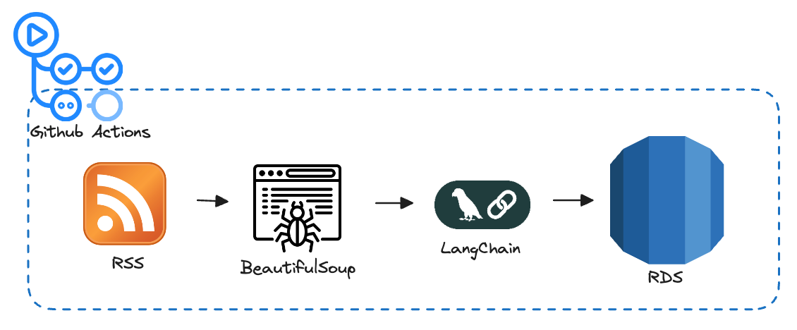

# Threed-llm 프로젝트

## 📜 개요

이 프로젝트는 지정된 웹 소스(예: 블로그)의 콘텐츠를 자동으로 수집(크롤링)하고, 수집된 텍스트를 LLM을 사용하여 간결하게 요약하며, 결과를 데이터베이스에 저장하고 관리하는 Python 기반 프로젝트입니다. 또한, 필요에 따라 추가적인 후처리 작업(예: S3에 결과물 업로드)을 수행할 수 있도록 설계되었습니다.

## ✨ 주요 기능

- **웹 콘텐츠 크롤링**: 설정된 블로그 및 웹 페이지로부터 게시물과 데이터를 수집합니다.
- **자동 텍스트 요약**: 수집된 긴 텍스트 콘텐츠를 LLM을 사용하여 간결하게 요약합니다.
- **데이터베이스 연동**: 수집 및 처리된 데이터를 효율적으로 저장하고 관리합니다. (SQLAlchemy ORM 사용 가능성)
- **유연한 설정 관리**: API 키, 크롤링 대상, 데이터베이스 정보 등을 외부 설정 파일을 통해 관리합니다.
- **모듈화된 구조**: 각 기능(크롤링, 요약, DB 처리, 후처리)이 별도의 모듈로 구성되어 유지보수 및 확장이 용이합니다.
- **(선택 사항) SSH 터널링**: 보안된 데이터베이스 연결을 지원합니다.
- **(선택 사항) S3 업로드**: 처리된 결과물이나 파일을 AWS S3에 업로드할 수 있습니다.

## 🏗️ 아키텍처

이 프로젝트의 주요 데이터 흐름 및 실행 환경은 다음과 같습니다.



- **RSS**: 다양한 블로그의 RSS 피드를 통해 최신 게시물 정보를 수집합니다. (`feedparser` 라이브러리 활용)
- **BeautifulSoup**: RSS 피드에 내용이 부족할 경우, 원본 웹 페이지에서 HTML을 파싱하여 추가 정보를 추출합니다. (`requests`로 HTML 다운로드 후 `BeautifulSoup`으로 파싱)
- **LangChain**: 수집된 콘텐츠를 LLM(Large Language Model)을 활용하여 요약합니다. (필요시 `api_config.py`의 API 키 사용)
- **RDS**: 최종적으로 처리된 원본 및 요약 데이터를 관계형 데이터베이스(예: AWS RDS)에 저장합니다. (`SQLAlchemy` ORM 및 `db_handler.py`를 통해 관리)
- **Github Actions**: 위의 전체 파이프라인은 GitHub Actions 환경에서 주기적으로 또는 특정 이벤트에 의해 자동 실행됩니다.

## 📁 프로젝트 구조

프로젝트의 주요 디렉토리 및 파일 구조는 다음과 같습니다:

```
threed-llm/
├── run.py                   # 애플리케이션 메인 실행 파일
├── requirements.txt         # Python 의존성 목록
├── src/
│   ├── __init__.py
│   ├── config/              # 설정 파일 디렉토리
│   │   ├── __init__.py
│   │   ├── api_config.py    # API 관련 설정
│   │   └── blog_config.py   # 블로그 크롤링 대상 등 설정
│   ├── core/                # 핵심 로직 디렉토리
│   │   ├── __init__.py
│   │   ├── db_handler.py    # 데이터베이스 CRUD 로직
│   │   └── post_processor.py # 데이터 후처리 로직
│   ├── database/            # 데이터베이스 연결 및 모델 정의
│   │   ├── __init__.py
│   │   ├── connection.py    # DB 연결 설정
│   │   └── models.py        # DB 테이블 모델 (ORM 스키마)
│   ├── models/              # 데이터 구조 (DTO, Enum)
│   │   ├── __init__.py
│   │   ├── dto.py           # Data Transfer Objects
│   │   └── enums.py         # 열거형 타입 정의
│   ├── services/            # 비즈니스 서비스 로직
│   │   ├── __init__.py
│   │   ├── crawler.py       # 웹 크롤러 서비스
│   │   ├── crawler_constants.py
│   │   ├── crawler_utils.py
│   │   ├── summarizer.py    # 텍스트 요약 서비스
│   │   └── summarizer_constants.py
│   └── utils/               # 유틸리티 모듈
│       ├── __init__.py
│       ├── s3_uploader.py   # S3 업로드 유틸리티
│       └── ssh_tunnel.py    # SSH 터널링 유틸리티
└── README.md                # 프로젝트 소개 파일 (현재 파일)
```

## ⚙️ 설치 및 설정

1.  **저장소 복제:**

    ```bash
    git clone <이 저장소의 URL>
    cd threed-llm
    ```

2.  **가상 환경 생성 및 활성화 (권장):**

    ```bash
    python -m venv venv
    source venv/bin/activate  # macOS/Linux
    # venv\Scripts\activate  # Windows
    ```

3.  **의존성 패키지 설치:**

    ```bash
    pip install -r requirements.txt
    ```

4.  **설정 파일 구성:**
    - `src/config/api_config.py`: 필요한 API 키 및 관련 설정을 입력합니다.
    - `src/config/blog_config.py`: 크롤링할 블로그 URL, 카테고리 등의 정보를 설정합니다.
    - 데이터베이스 연결 정보는 `src/database/connection.py` 또는 관련 환경 변수를 통해 설정해야 할 수 있습니다. (프로젝트 구현 방식에 따라 확인 필요)

## 🚀 실행 방법

프로젝트 루트 디렉토리에서 다음 명령어를 사용하여 애플리케이션을 실행합니다:

```bash
python run.py
```

## 🔧 설정 상세

- **API 설정 (`src/config/api_config.py`):**
  - 텍스트 요약 서비스 또는 기타 외부 API 사용 시 필요한 키와 엔드포인트 정보를 관리합니다.
- **블로그 설정 (`src/config/blog_config.py`):**
  - 크롤링 대상 블로그의 URL, 수집할 게시물의 조건 등을 정의합니다.
- **데이터베이스 설정:**
  - `src/database/connection.py` 파일 내에서 직접 수정하거나, 환경 변수를 통해 주입받는 방식으로 데이터베이스 접속 정보를 설정합니다. (예: DB 종류, 호스트, 포트, 사용자명, 비밀번호 등)
